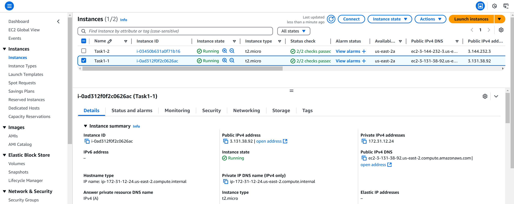
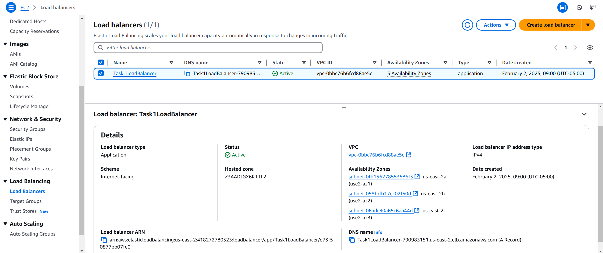
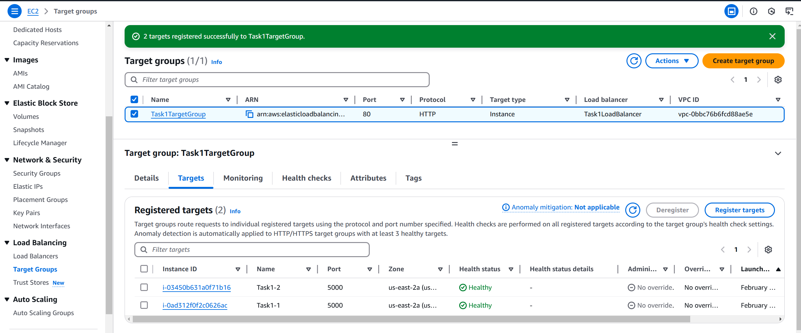
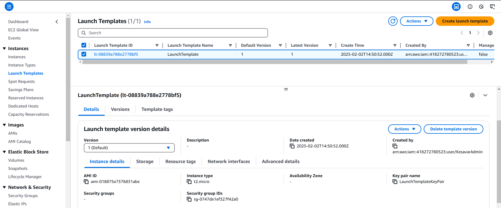
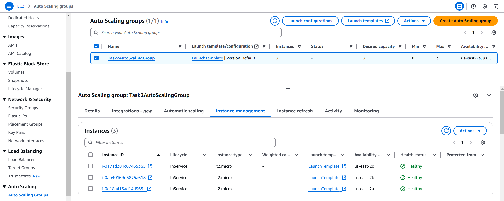
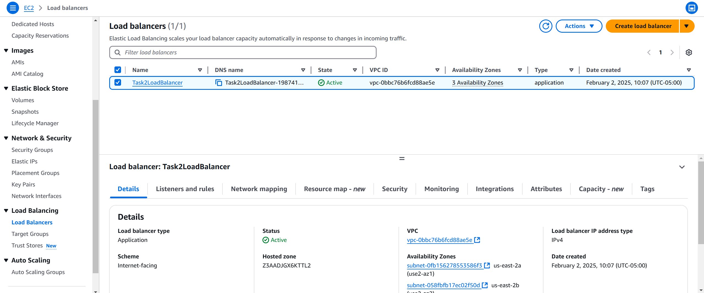
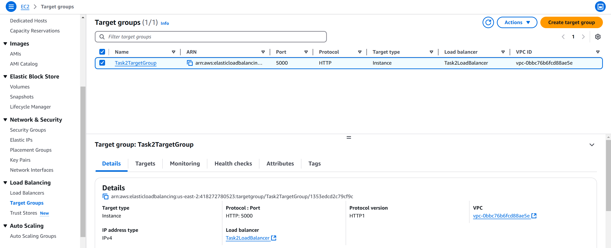
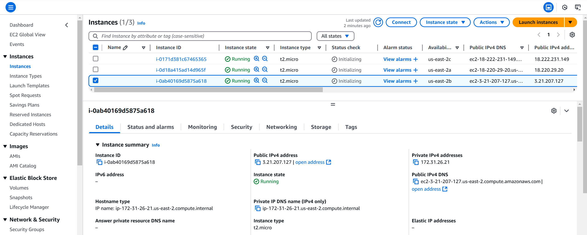

# Machine Problem 2: Load Balancing + Auto Scaling

This assignment focused on implementing load balancing and auto-scaling using Amazon Web Services (AWS) EC2.

## Assignment Overview

The assignment was divided into two sections:

1. **AWS Elastic Load Balancing (ELB)**: I set up a load balancer with a target group to distribute traffic between two web servers hosting a simple seed value application on Amazon EC2 instances.
2. **Amazon EC2 Auto Scaling**: I ereated an auto-scaling group to dynamically adjust the number of EC2 instances based on CPU usage, hosting a slightly different application that responds with its IP address and can trigger CPU stress.

### Section 1: Load Balancing

## Web Application (`app.py`): 

I developed a Python Flask web application (`app.py`) to manage a "seed" integer value. It handles two HTTP requests:
*   POST: with JSON payload `{"num": 100}` updates the seed value.
*   GET: Retrieves the current seed value (returned as a string).

## EC2 Instances 

I launched two identical EC2 instances using the latest Amazon Linux AMI. I installed Python and Flask on both instances. I deployed my web application to each instance, running it on the same port (e.g., 5000). I configured the EC2 instances' security groups to allow inbound traffic on port 5000 from anywhere (0.0.0.0/0).

## Load Balancer

I created an AWS Application Load Balancer. This type of load balancer is specifically designed for HTTP/HTTPS traffic, which is what my application uses. I configured the load balancer to listen on port 80 for HTTP traffic. This means that when a user accesses the load balancer's DNS name on port 80, the load balancer will accept the connection. 

## Target Group 

I created a target group to contain the EC2 instances that receive traffic. I registered the two instances, specifying port 5000. This directs the load balancer to forward traffic from port 80 to port 5000 on the instances. I set the health check path to "/".  A custom security group, allowing inbound HTTP traffic from anywhere, was used for the load balancer.

## Load Balancing Details 

The Application Load Balancer distributes incoming HTTP requests across the registered EC2 instances in a round-robin fashion by default. This helps to prevent any single instance from being overloaded and improves the overall availability and responsiveness of the application. The load balancer also handles connection management, SSL termination (if configured), and other tasks, freeing up the web servers to focus on running the application.

## Testing

I tested the load balancer by accessing its DNS name in my browser and using Postman to send POST and GET requests. I confirmed the load balancer distributed requests between the two EC2 instances, and that I could update and retrieve the seed value. I observed that subsequent requests were handled by different instances.

### Section 2: Auto Scaling

## HTTP Server (`serve.py`): 
I created a Python Flask application, `serve.py`, with two endpoints:
*   POST: Triggers CPU stress by running `stress_cpu.py` in a separate process using `subprocess.Popen()`.  This allows the Flask server to remain responsive.
*   GET: Returns the instance's private IP address using `socket.gethostname()`.

## Launch Template

I created a launch template to define the configuration for EC2 instances launched by the auto-scaling group.  The "User data" section contains a bash script (`serve_setup.sh`) that:

*   Updates system packages.
*   Installs `stress-ng`, `htop`, Python 3, `pip`, `flask`, and `git`.
*   Clones my web server code from my private GitHub repository (using a personal access token).
*   Navigates to the code directory.
*   Starts the `serve.py` application.

## Auto Scaling Group 

I created an auto-scaling group and configured it to use the launch template I created. I set the minimum size to 0, the maximum size to 3, and the desired capacity to 1. This means that the auto-scaling group will always try to maintain at least 0 instances, will never launch more than 3 instances, and will start with 1 instance. 

## Load Balancer

I configured the auto-scaling group to be associated with a *new* internet-facing load balancer (separate from the one in Section 1).  This separate load balancer is important for isolating the two sections of the assignment.

## Target Group

I initialized a *new* target group to listen to automatically listen to all instances created on port 5000. This will allow newly created instances to automatically work with the new target group.

## Auto Scaling Details

The auto-scaling group monitors the CPU utilization of the EC2 instances.  It uses the CloudWatch service to collect this metric.  Based on the scaling policy I defined, the auto-scaling group automatically adjusts the number of running instances.

## Scaling Policy

I configured a target tracking scaling policy to maintain average CPU utilization around 50%. The policy adds an instance when CPU usage exceeds 50% and removes one when it drops below 50%. A 300-second cooldown period prevents overly rapid scaling adjustments.

## Testing

I tested the auto-scaling functionality by sending POST requests to the load balancer using Postman. I monitored CPU utilization with `htop` via SSH and verified that the auto-scaling group launched new instances when CPU usage exceeded 50%. I confirmed these instances automatically ran `serve.py` and responded to GET requests.  I also verified the group scaled down after the load decreased.